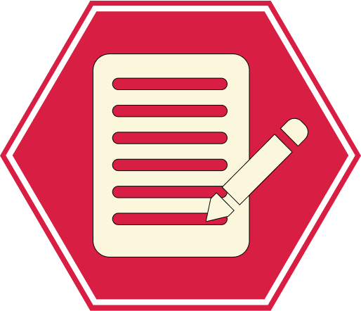

<a name="readme-top"></a>

<div align="center">
  
  <h1><b>Blog App</b></h1>
</div>

# 📗 Table of Contents

- [📖 About the Project](#about-project)
  - [🛠 Built With](#built-with)
    - [Tech Stack](#tech-stack)
    - [Key Features](#key-features)
  - [🚀 Live Demo](#live-demo)
- [💻 Getting Started](#getting-started)
  - [Setup](#setup)
  - [Prerequisites](#prerequisites)
  - [Install](#install)
  - [Usage](#usage)
  - [Run tests](#run-tests)
  - [Deployment](#triangular_flag_on_post-deployment)
- [👥 Authors](#authors)
- [🔭 Future Features](#future-features)
- [🤝 Contributing](#contributing)
- [⭐️ Show your support](#support)
- [🔭 Acknowledgements](#acknowledgements)
- [❓ FAQ](#faq)
- [📝 License](#license)

<!-- PROJECT DESCRIPTION -->

# 🎯 Blog App<a name="about-project"></a>

The Blog app is a classic example of a blog website. Here I create a fully functional website that will show the list of posts and empower readers to interact with them by adding comments and liking posts.


## 🛠 Built With <a name="built-with"></a>

### Tech Stack <a name="tech-stack"></a>

<details>
  <summary>Technology</summary>
  <ul>
    <li>Ruby</li>
    <li>Rails</li>
    <li>PostgresSQL</li>
  </ul>
</details>

<details>
  <summary>Tools</summary>
  <ul>
    <li>VS Code</li>
    <li>GIT</li>
    <li>GITHUB</li>
  </ul>
</details>

<!-- Features -->

### Key Features <a name="key-features"></a>

This project is a simple Blog app. The main features are:

- **_User authentication and registration:_** Users can sign up for an account, log in, and log out.
- **_Post creation:_** Author can create new posts with a title and text content.
- **_Post management:_** Author can view, edit, and delete their own posts.
- **_Commenting and Liking:_** Users can add comments and likes to posts.

<p align="right">(<a href="#readme-top">back to top</a>)</p>

<!-- LIVE DEMO -->

## 🚀 Live Demo <a name="live-demo"></a>

<!-- - [Live Demo Link]() -->

Sorr, Currently no active link available.

<p align="right">(<a href="#readme-top">back to top</a>)</p>

<!-- GETTING STARTED -->

## 💻 Getting Started <a name="getting-started"></a>

To get a local copy up and running follow these simple example steps.

### Prerequisites

you have to those tools in your local machine.

- [ ] Ruby (3.2.0)
- [ ] Rails (7.0.4)
- [ ] PostgresSQL
- [ ] GIT & GITHUB
- [ ] Any Code Editor (VS Code, Brackets, etc)

### Clone Repo

Clone the project using the following bash command in an appropriate location.

```bash
  git clone git@github.com:shahadat3669/blog-app.git
```

Go to the project directory.

```bash
  cd blog-app
```

### Create database.yml file

Copy the sample database.yml file and edit the database configuration as required.

```bash
  cp config/database.yml.sample config/database.yml
```

### Encrypted Credentials

For encrypted user name and password for the SMTP server and databases you need master key. Contact author for it. Here is a [documentation link](https://medium.com/craft-academy/encrypted-credentials-in-ruby-on-rails-9db1f36d8570) for encrypted credentials.

```bash
credentials.yml file example
# aws:
#   access_key_id: 123
#   secret_access_key: 345

# Used as the base secret for all MessageVerifiers in Rails, including the one protecting cookies.
secret_key_base: secret_key_base
postgres:
  username: username
  password: password

smtp:
  user: user
  password: password

```

### Run the server

In the project directory, you can run the project by using following bash command:

```bash
  rails server
```

And now you can visit the site with the URL http://localhost:3000

### Testing files

For testing you can run:

```bash
  rspec ./space
```

<p align="right">(<a href="#readme-top">back to top</a>)</p>

<!-- AUTHORS -->

## 👥 Authors <a name="authors"></a>

### First Author:

**Shahadat Hossain**

[](https://github.com/shahadat3669) [](https://linkedin.com/in/shahadat-cseng) [](https://twitter.com/shahadat3669)

<p align="right">(<a href="#readme-top">back to top</a>)</p>

## 🔭 Future Features <a name="future-features"></a>

- [ ] **Live demo will added soon**

<p align="right">(<a href="#readme-top">back to top</a>)</p>

<!-- CONTRIBUTING -->

## 🤝 Contributing <a name="contributing"></a>

Contributions, issues, and feature requests are welcome!

Feel free to check the [issues page](../../../issues/).

<p align="right">(<a href="#readme-top">back to top</a>)</p>

<!-- SUPPORT -->

## 👋 Show your support <a name="support"></a>

Give a ⭐️ if you like this project!

<p align="right">(<a href="#readme-top">back to top</a>)</p>

<!-- ACKNOWLEDGEMENTS -->

## 🔭Acknowledgments <a name="acknowledgements"></a>

- My Family.
- [Microverse Team](https://www.microverse.org/).

<p align="right">(<a href="#readme-top">back to top</a>)</p>

<!-- FAQ (optional) -->

## ❓ FAQ <a name="faq"></a>

- **Can I use this project for personal use?**

  - Yes, you can use it.

<p align="right">(<a href="#readme-top">back to top</a>)</p>

## 📝 License <a name="license"></a>

This project is [MIT](./LICENSE) licensed.

<p align="right">(<a href="#readme-top">back to top</a>)</p>
